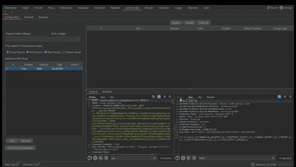

# AutoIntruder

A BurpSuite plugin designed to help find authorization and IDOR issues by finding requests and payloads that match a pattern (like a UUID pattern) and send all variations that were found
of the the pattern in the request history.


## Description
AutoIntruder is an extension for Burp Suite that help security researchers find security vulnerabilities, by matching and replacing strings from their proxy history on mass.

AutoIntruder works by allowing users to match requests from their browsing history and that fit a pattern the the user configures. Next the user add his payloads. Then AutoIntruder replaces the matched requests with the payloads and sends them to the target.

## Demo




## Usage
Using the tool requires 4 steps:

```sh
1. Configure- Define the regex pattern you want to use. This will can AutoIntruder to search through your proxy history for any requests that match the pattern. 

1.a (Optional) You can further filter the request AutoIntruder matches, by configuring the filter rules.
1.b (Optional) Disable/Enable or edit any request AutoIntruder finds.

2. Payloads - Add any payloads you want. Payloads can be added manually or using the Auto Payload Generator, which looks through the proxy history for any payloads that match the given pattern

3. Disable/Enable or edit any request AutoIntruder has generated under the Request tab.

4. Fire the requests and find some vulns.
```

## Features

 - Multi-Threaded request sender.
 - Ability to grep for requests from history according to regex and configurable rules.
 - Ability to grep for payloads according to regex patterns.
 - Requests can be manually edited before being sent.
 - Uses the Montoya API


## Use cases

1) Finding IDORs by grepping for UUIDs and replacing them other UUIDs
2) Findings SSRFs by grepping for URLs/IP addresses and replacing them with a Collaborator link
3) Custom fuzzing by grepping for custom patterns and replacing them with fuzzing payloads

## Installation

1. Clone the repo:
    ```sh
    git clone https://github.com/cybenari/AutoIntruder.git
    ```
2. Navigate to the project directory:
    ```sh
    cd AutoIntruder
    ```
3. Build:
    ```sh
    mvn package
    ```
4. Run the project by loading the generated JAR file as a BurpSuite Extension.
    

## Contact
idan@cybenari.com